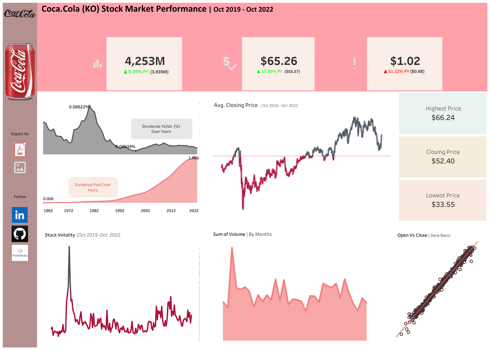
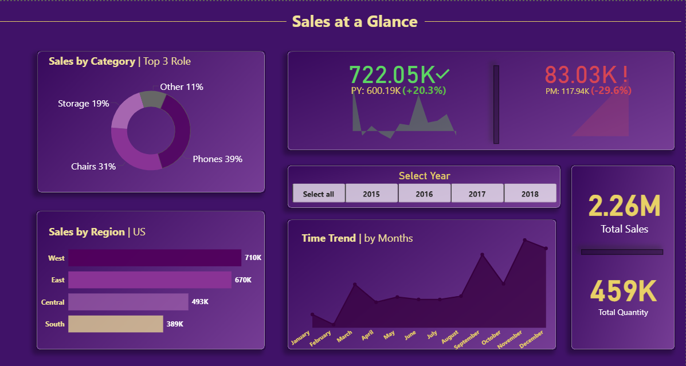
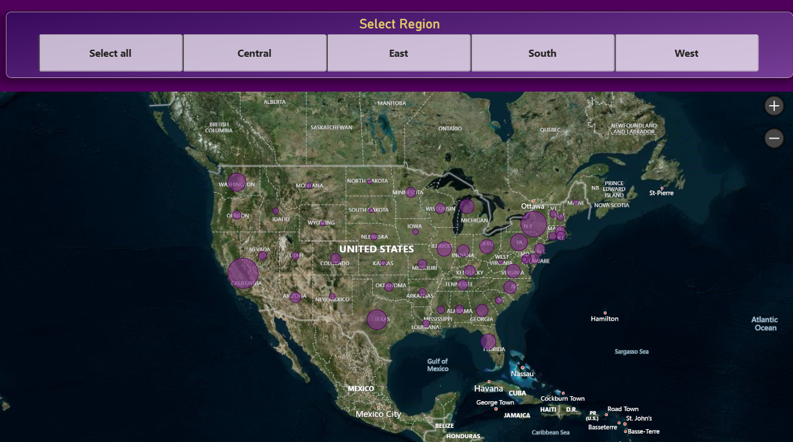

# Business Intelligence & Executive Dashboard Showcase | Aesthetic Over Analytics
This repository is a gallery of **visual design and UI experimentation**. 

> **Disclaimer:** The visualizations found here are optimized for **aesthetic beauty, motion, and layout**. While they may use real datasets, they are not intended to serve as a tool for deep data analysis or business intelligence. 

**Focus areas:**
* Color theory and typography in dashboards
* Interactive UI components
**Portfolio of High-Impact Visualizations in Tableau & Power BI**

---

##  The Vision
This repository demonstrates my ability to transform raw data into "Executive-Ready" dashboards. My design philosophy focuses on **Minimalism, Strategic KPI Placement, and User-Centric Navigation**, ensuring that stakeholders can find answers in seconds.

---

##  Project 1: Coca-Cola (KO) Financial Market Audit
**Platform:** Tableau | **Analysis Type:** Historical Stock Performance

This dashboard tracks 60 years of financial growth, focusing on dividend reliability and price volatility.

### Visual Preview

### Visual Highlights:
* **The "Dual-Perspective" Yield Chart:** I used a split-view to compare Dividends Paid vs. Yield % over time, making it easy to spot long-term stability.
* **Modern UI Layout:** Used a custom "Can-Red" color palette to maintain brand identity while ensuring high data readability.
* **Trend Analysis:** Integrated a scatter plot to analyze Open vs. Close daily correlations.

---

##  Project 2: Global Sales & Regional Performance
**Platform:** Power BI | **Analysis Type:** Retail Operations & Geospatial Audit

A comprehensive look at a $2.26M retail portfolio, optimized for regional managers.

###  Visual Preview

###  Visual Highlights:
* **"At-a-Glance" KPI Cards:** Placed Total Sales and Quantity in a vertical side-rail for instant status checks.
* **Geospatial Intelligence:** Developed an interactive map layer to visualize market density across the US (California and New York identified as core hubs).
* **Segment Breakdown:** Used a custom Donut-to-Bar flow to show how just 3 categories (Phones, Chairs, Storage) dominate the revenue stream.

---

##  Design & Technical Expertise
| Focus Area | Skill Description |
| :--- | :--- |
| **Tooling** | Proficiency in **Power BI** and **Tableau**. |
| **UI/UX for BI** | Custom background design, consistent color-coding, and intuitive slicer placement. |
